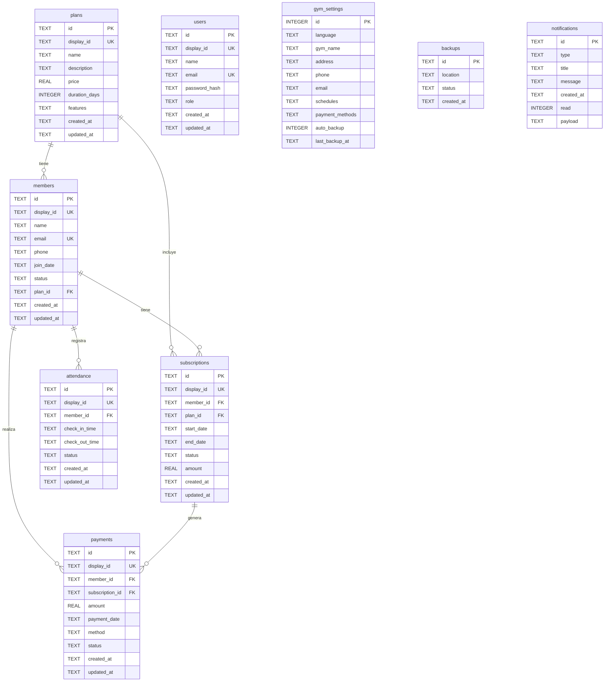

# GymRestBack

Backend ligero en Node.js + Express que expone el API `/api/v1` requerido por el frontend Flutter del gimnasio. Usa SQLite (archivo `dev.db`) para desarrollo y puede migrarse fácilmente a PostgreSQL cambiando el adaptador.

## Stack principal

- Node.js 20 + Express 5.
- SQLite con [`better-sqlite3`](https://github.com/WiseLibs/better-sqlite3) y migraciones/seed en SQL plano.
- Autenticación JWT, roles básicos (`admin`, `staff`).
- Utilidades: `luxon` (fechas), `json2csv` (exportaciones), `node-cron` (tareas diarias).

## Requisitos

- Node.js >= 18
- npm >= 9

## Configuración rápida

```bash
cp .env.example .env              # Ajusta puertos, origen del frontend, etc.
npm install
npm run migrate                   # Crea tablas en SQLite
npm run seed                      # Carga los datos que replica dummy_data.dart
npm run dev                       # Inicia API con nodemon en http://localhost:3000
```

Credenciales demo: `admin@gymrest.test / admin123`

## Scripts disponibles

| Script        | Descripción                                               |
|---------------|-----------------------------------------------------------|
| `npm run dev` | Ejecuta el servidor con recarga automática                |
| `npm start`   | Ejecuta el servidor en modo producción                    |
| `npm run migrate` | Aplica todos los archivos `db/migrations/*.sql`       |
| `npm run seed`    | Ejecuta los seeders `db/seeds/*.sql`                  |
| `npm run db:reset` | Combina migraciones + seed                           |
| `npm test`    | Corre Jest (permite cero tests con `--passWithNoTests`)   |

## Arquitectura

### Diagrama de Arquitectura del Sistema

```mermaid
graph TB
    subgraph "Cliente"
        FE[Frontend Flutter]
    end
    
    subgraph "Capa de API - Express"
        SERVER[server.js<br/>HTTP Server]
        APP[app.js<br/>Express App]
        
        subgraph "Middlewares"
            CORS[CORS<br/>Origen permitido]
            HELMET[Helmet<br/>Seguridad]
            AUTH_MW[authGuard<br/>JWT Validation]
            MORGAN[Morgan<br/>Logging]
            ERROR[Error Handler]
        end
        
        subgraph "Routers - /api/v1"
            AUTH_R[auth.router]
            MEMBERS_R[members.router]
            PLANS_R[plans.router]
            SUBS_R[subscriptions.router]
            PAYS_R[payments.router]
            ATT_R[attendance.router]
            SETT_R[settings.router]
            NOTIF_R[notifications.router]
            REPORTS_R[reports.router]
        end
    end
    
    subgraph "Capa de Servicios"
        AUTH_S[auth.service<br/>JWT, Hash]
        MEMBERS_S[members.service<br/>CRUD + Filters]
        PLANS_S[plans.service<br/>CRUD]
        SUBS_S[subscriptions.service<br/>Status + Validations]
        PAYS_S[payments.service<br/>CRUD + Receipts]
        ATT_S[attendance.service<br/>Check-in/out]
        SETT_S[settings.service<br/>Config + Backup]
        NOTIF_S[notifications.service<br/>CRUD]
        REPORTS_S[reports.service<br/>Aggregations]
    end
    
    subgraph "Utilidades"
        IDS[ids.js<br/>UUID + Display IDs]
        CSV[csv.js<br/>json2csv]
        PAGINATION[pagination.js<br/>Offset/Limit]
        RESPONSE[response.js<br/>Format]
    end
    
    subgraph "Configuración"
        ENV[env.js<br/>Variables]
        DB_CONFIG[database.js<br/>better-sqlite3]
    end
    
    subgraph "Base de Datos"
        SQLITE[(SQLite<br/>dev.db)]
        MIGRATIONS[db/migrations<br/>001_create_tables.sql]
        SEEDS[db/seeds<br/>001_seed_core.sql]
    end
    
    subgraph "Tareas Programadas"
        CRON[schedulers/index.js<br/>node-cron]
        SUB_TASK[Actualizar suscripciones<br/>03:00 AM diario]
    end
    
    FE -->|HTTP/REST| SERVER
    SERVER --> APP
    APP --> CORS
    CORS --> HELMET
    HELMET --> MORGAN
    MORGAN --> AUTH_R
    MORGAN --> AUTH_MW
    AUTH_MW --> MEMBERS_R
    AUTH_MW --> PLANS_R
    AUTH_MW --> SUBS_R
    AUTH_MW --> PAYS_R
    AUTH_MW --> ATT_R
    AUTH_MW --> SETT_R
    AUTH_MW --> NOTIF_R
    AUTH_MW --> REPORTS_R
    
    AUTH_R --> AUTH_S
    MEMBERS_R --> MEMBERS_S
    PLANS_R --> PLANS_S
    SUBS_R --> SUBS_S
    PAYS_R --> PAYS_S
    ATT_R --> ATT_S
    SETT_R --> SETT_S
    NOTIF_R --> NOTIF_S
    REPORTS_R --> REPORTS_S
    
    AUTH_S --> IDS
    AUTH_S --> ENV
    MEMBERS_S --> DB_CONFIG
    MEMBERS_S --> IDS
    MEMBERS_S --> PAGINATION
    MEMBERS_S --> CSV
    PLANS_S --> DB_CONFIG
    SUBS_S --> DB_CONFIG
    SUBS_S --> IDS
    PAYS_S --> DB_CONFIG
    PAYS_S --> IDS
    ATT_S --> DB_CONFIG
    ATT_S --> IDS
    SETT_S --> DB_CONFIG
    NOTIF_S --> DB_CONFIG
    REPORTS_S --> DB_CONFIG
    REPORTS_S --> CSV
    
    MEMBERS_R --> RESPONSE
    PLANS_R --> RESPONSE
    SUBS_R --> RESPONSE
    PAYS_R --> RESPONSE
    ATT_R --> RESPONSE
    SETT_R --> RESPONSE
    NOTIF_R --> RESPONSE
    REPORTS_R --> RESPONSE
    
    DB_CONFIG --> SQLITE
    MIGRATIONS --> SQLITE
    SEEDS --> SQLITE
    
    SERVER --> CRON
    CRON --> SUB_TASK
    SUB_TASK --> SUBS_S
    
    AUTH_MW --> ERROR
    MEMBERS_R --> ERROR
    PLANS_R --> ERROR
    SUBS_R --> ERROR
    PAYS_R --> ERROR
    ATT_R --> ERROR
    SETT_R --> ERROR
    NOTIF_R --> ERROR
    REPORTS_R --> ERROR
    
    style FE fill:#e1f5ff
    style SQLITE fill:#ffebee
    style CRON fill:#fff3e0
    style AUTH_MW fill:#f3e5f5
```



### Descripción de Capas

#### 1. **Capa de Presentación (Cliente)**
- Frontend Flutter que consume la API REST

#### 2. **Capa de API (Express)**
- **`server.js`**: Inicializa el servidor HTTP y los schedulers
- **`app.js`**: Configura Express, middlewares y monta los routers
- **Middlewares**:
  - `CORS`: Control de origen para peticiones cross-origin
  - `Helmet`: Seguridad HTTP (headers)
  - `authGuard`: Validación JWT para rutas protegidas
  - `Morgan`: Logging de peticiones HTTP
  - `Error Handler`: Manejo centralizado de errores

#### 3. **Capa de Routers**
- Cada módulo expone un router con endpoints REST
- Filtros, validación de entrada y construcción de respuestas
- Todas las rutas (excepto `/auth`) requieren autenticación

#### 4. **Capa de Servicios (Lógica de Negocio)**
- Contiene la lógica de negocio y acceso a datos
- Cada servicio maneja:
  - Validaciones de negocio
  - Construcción de consultas SQL
  - Transformación de datos
  - Reglas específicas del dominio

#### 5. **Capa de Utilidades**
- **`ids.js`**: Generación de UUIDs y IDs legibles (M, P, S, PAY, A)
- **`csv.js`**: Exportación de datos a CSV
- **`pagination.js`**: Paginación (offset/limit)
- **`response.js`**: Formato estandarizado `{ data, meta, errors }`

#### 6. **Capa de Configuración**
- **`env.js`**: Variables de entorno
- **`database.js`**: Singleton de conexión SQLite (better-sqlite3)

#### 7. **Capa de Datos**
- **SQLite** (`dev.db`): Base de datos local
- **Migrations**: Esquema de tablas
- **Seeds**: Datos iniciales

#### 8. **Tareas Programadas**
- **`schedulers/index.js`**: Tareas cron con `node-cron`
- Actualización diaria de estados de suscripciones (03:00 AM)
- Generación de notificaciones de vencimiento

### Flujo de una Petición

1. **Cliente** → Envía petición HTTP al servidor
2. **CORS** → Valida origen permitido
3. **Helmet** → Aplica headers de seguridad
4. **Morgan** → Registra la petición
5. **authGuard** → Valida token JWT (si es ruta protegida)
6. **Router** → Enruta a la función correspondiente
7. **Service** → Ejecuta lógica de negocio y consultas SQL
8. **Database** → Ejecuta operaciones en SQLite
9. **Response** → Formatea respuesta `{ data, meta, errors }`
10. **Error Handler** → Captura y formatea errores si ocurren

### Estructura de Archivos

```
src/
├── app.js              # Configuración Express + middlewares + routers
├── server.js           # Inicialización HTTP server + schedulers
├── config/
│   ├── env.js          # Variables de entorno
│   └── database.js     # Conexión SQLite (singleton)
├── middlewares/
│   ├── auth.js         # JWT validation (authGuard, allowRoles)
│   └── error-handler.js # Manejo centralizado de errores
├── modules/            # Módulos de negocio
│   ├── auth/
│   │   ├── auth.router.js
│   │   └── auth.service.js
│   ├── members/
│   ├── plans/
│   ├── subscriptions/
│   ├── payments/
│   ├── attendance/
│   ├── settings/
│   ├── notifications/
│   └── reports/
├── schedulers/
│   └── index.js        # Tareas cron (suscripciones)
└── utils/
    ├── ids.js          # Generación de IDs
    ├── csv.js          # Exportación CSV
    ├── pagination.js   # Paginación
    └── response.js     # Formato de respuestas
```

Las respuestas siguen el formato `{ data, meta, errors }` para facilitar paginación y manejo de errores en el frontend.

## Modelo de Base de Datos

Diagrama entidad-relación del esquema:



### Relaciones principales

- **members → plans**: Un miembro puede tener un plan asignado (relación opcional)
- **members → subscriptions**: Un miembro puede tener múltiples suscripciones (1:N, CASCADE DELETE)
- **subscriptions → plans**: Una suscripción pertenece a un plan (N:1)
- **members → payments**: Un miembro puede realizar múltiples pagos (1:N)
- **subscriptions → payments**: Una suscripción puede generar múltiples pagos (1:N)
- **members → attendance**: Un miembro puede tener múltiples registros de asistencia (1:N)

Las tablas `gym_settings`, `backups` y `notifications` son independientes y no tienen relaciones foráneas.

## Endpoints clave

Todos se exponen bajo `/api/v1`:

- `POST /auth/login | register | forgot-password | logout`
- `GET/POST/PUT/DELETE /members` + `GET /members/export`
- `GET/POST/PUT/DELETE /plans`
- `GET/POST/PUT/DELETE /subscriptions` + `GET /subscriptions/export`
- `GET/POST/PUT/DELETE /payments`, `GET /payments/export`, `GET /payments/:id/receipt`
- `GET/POST/PUT/DELETE /attendance`, `POST /attendance/check-in`, `POST /attendance/check-out/:id`, `GET /attendance/export`
- `GET/PUT /settings`, `POST /settings/backup`, `GET /settings/backups`
- `GET /notifications`, `POST /notifications/:id/read`
- `GET /reports/summary`, `/reports/export-csv`, `/reports/export-pdf` (contenido base64 simulado)

Consulta `src/modules/**` para ver cada implementación y filtros soportados.

## Datos y reglas destacadas

- IDs públicos con prefijo (`M`, `P`, `S`, `PAY`, `A`), además de UUID interno.
- Suscripciones recalculan `endDate = startDate + durationDays` y un cron diario marca `Vencida` + genera notificaciones `planWarning`.
- Check-in valida suscripción activa y evita duplicados abiertos.
- Pagos verifican relación miembro ↔ suscripción y disparan notificación `payment`.
- Exportaciones CSV usan `json2csv` y envían encabezado `Content-Disposition`.
- Reportes agregan métricas (ingresos, crecimiento, distribución de planes) con periodo rolling de 6 meses.

## Pruebas y futuras integraciones

- Jest listo para pruebas unitarias/e2e con `supertest`. Solo agrega archivos `*.test.js` en `tests/`.
- `better-sqlite3` puede sustituirse por `pg` manteniendo los mismos servicios (toda la lógica SQL está centralizada en los servicios).
- Agrega más tareas cron en `src/schedulers/index.js` si necesitas automatizaciones adicionales.

---

¿Dudas o mejoras? Actualiza este README después de modificar scripts o endpoints para mantener la documentación sincronizada con el frontend Flutter.