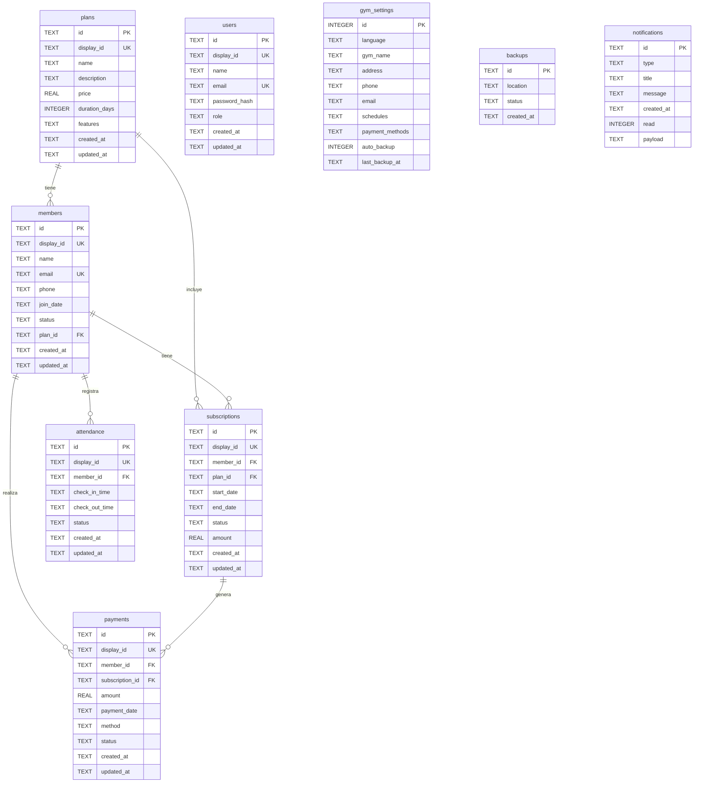

# GymRestBack

Backend ligero en Node.js + Express que expone el API `/api/v1` requerido por el frontend Flutter del gimnasio. Usa SQLite (archivo `dev.db`) para desarrollo y puede migrarse fácilmente a PostgreSQL cambiando el adaptador.

## Stack principal

- Node.js 20 + Express 5.
- SQLite con [`better-sqlite3`](https://github.com/WiseLibs/better-sqlite3) y migraciones/seed en SQL plano.
- Autenticación JWT, roles básicos (`admin`, `staff`).
- Utilidades: `luxon` (fechas), `json2csv` (exportaciones), `node-cron` (tareas diarias).

## Requisitos

- Node.js >= 18
- npm >= 9

## Configuración rápida

```bash
cp .env.example .env              # Ajusta puertos, origen del frontend, etc.
npm install
npm run migrate                   # Crea tablas en SQLite
npm run seed                      # Carga los datos que replica dummy_data.dart
npm run dev                       # Inicia API con nodemon en http://localhost:3000
```

Credenciales demo: `admin@gymrest.test / admin123`

## Scripts disponibles

| Script        | Descripción                                               |
|---------------|-----------------------------------------------------------|
| `npm run dev` | Ejecuta el servidor con recarga automática                |
| `npm start`   | Ejecuta el servidor en modo producción                    |
| `npm run migrate` | Aplica todos los archivos `db/migrations/*.sql`       |
| `npm run seed`    | Ejecuta los seeders `db/seeds/*.sql`                  |
| `npm run db:reset` | Combina migraciones + seed                           |
| `npm test`    | Corre Jest (permite cero tests con `--passWithNoTests`)   |

## Arquitectura

- `src/app.js`: instancia Express, middleware CORS/seguridad y monta routers.
- `src/config`: carga de variables y conexión SQLite (`better-sqlite3`).
- `src/modules/*`: cada subcarpeta contiene `*.service.js` (reglas + SQL) y `*.router.js` (endpoints).
- `db/migrations`: esquema SQL (IDs legibles + UUID internos).
- `db/seeds`: datos iniciales equivalentes al `dummy_data.dart`.
- `scripts`: helpers para correr migraciones/seeds sin dependencias externas.

Las respuestas siguen el formato `{ data, meta, errors }` para facilitar paginación y manejo de errores en el frontend.

## Modelo de Base de Datos

Diagrama entidad-relación del esquema:



### Relaciones principales

- **members → plans**: Un miembro puede tener un plan asignado (relación opcional)
- **members → subscriptions**: Un miembro puede tener múltiples suscripciones (1:N, CASCADE DELETE)
- **subscriptions → plans**: Una suscripción pertenece a un plan (N:1)
- **members → payments**: Un miembro puede realizar múltiples pagos (1:N)
- **subscriptions → payments**: Una suscripción puede generar múltiples pagos (1:N)
- **members → attendance**: Un miembro puede tener múltiples registros de asistencia (1:N)

Las tablas `gym_settings`, `backups` y `notifications` son independientes y no tienen relaciones foráneas.

## Endpoints clave

Todos se exponen bajo `/api/v1`:

- `POST /auth/login | register | forgot-password | logout`
- `GET/POST/PUT/DELETE /members` + `GET /members/export`
- `GET/POST/PUT/DELETE /plans`
- `GET/POST/PUT/DELETE /subscriptions` + `GET /subscriptions/export`
- `GET/POST/PUT/DELETE /payments`, `GET /payments/export`, `GET /payments/:id/receipt`
- `GET/POST/PUT/DELETE /attendance`, `POST /attendance/check-in`, `POST /attendance/check-out/:id`, `GET /attendance/export`
- `GET/PUT /settings`, `POST /settings/backup`, `GET /settings/backups`
- `GET /notifications`, `POST /notifications/:id/read`
- `GET /reports/summary`, `/reports/export-csv`, `/reports/export-pdf` (contenido base64 simulado)

Consulta `src/modules/**` para ver cada implementación y filtros soportados.

## Datos y reglas destacadas

- IDs públicos con prefijo (`M`, `P`, `S`, `PAY`, `A`), además de UUID interno.
- Suscripciones recalculan `endDate = startDate + durationDays` y un cron diario marca `Vencida` + genera notificaciones `planWarning`.
- Check-in valida suscripción activa y evita duplicados abiertos.
- Pagos verifican relación miembro ↔ suscripción y disparan notificación `payment`.
- Exportaciones CSV usan `json2csv` y envían encabezado `Content-Disposition`.
- Reportes agregan métricas (ingresos, crecimiento, distribución de planes) con periodo rolling de 6 meses.

## Pruebas y futuras integraciones

- Jest listo para pruebas unitarias/e2e con `supertest`. Solo agrega archivos `*.test.js` en `tests/`.
- `better-sqlite3` puede sustituirse por `pg` manteniendo los mismos servicios (toda la lógica SQL está centralizada en los servicios).
- Agrega más tareas cron en `src/schedulers/index.js` si necesitas automatizaciones adicionales.

---

¿Dudas o mejoras? Actualiza este README después de modificar scripts o endpoints para mantener la documentación sincronizada con el frontend Flutter.